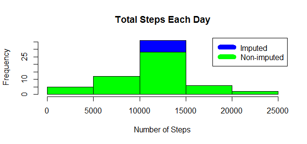

library(ggplot2)
library(dplyr)

```r
## Loading and preprocessing the data
data <- read.csv("activity.csv")
```

```r
## What is mean total number of steps taken per day?
#Calculate the total number of steps taken per day
steps_by_day <- aggregate(steps ~ date, data, sum)
#Make a histogram of the total number of steps taken each day
hist(steps_by_day$steps, main = paste("Total Steps Each Day"), col="green",xlab="Number of Steps")
```

<!-- -->

```r
#Calculate and report the mean and median of the total number of steps taken per day
rmean <- mean(steps_by_day$steps)
rmean
```

```
## [1] 10766.19
```

```r
rmedian <- median(steps_by_day$steps)
rmedian
```

```
## [1] 10765
```
<!-- -->

```r
## What is the average daily activity pattern?
# Make a time series plot (i.e. \color{red}{\verb|type = "l"|}type = "l") of the 5-minute interval (x-axis) and the average number of steps taken, averaged across all days (y-axis)
steps_by_interval <- aggregate(steps ~ interval, data, mean)
plot(steps_by_interval$interval,steps_by_interval$steps, type="l", xlab="Interval", ylab="Number of Steps",main="Average Number of Steps per Day by Interval")
```

<!-- -->

```r
#3Which 5-minute interval, on average across all the days in the dataset, contains the maximum number of steps
max_interval <- steps_by_interval[which.max(steps_by_interval$steps),1]
max_interval
```

```
## [1] 835
```
<!-- -->

```r
## Imputing missing values
#Calculate and report the total number of missing values in the dataset
NATotal <- sum(!complete.cases(data))
NATotal
```

```
## [1] 2304
```

```r
#Using Mean for the day compute missing values
StepsAverage <- aggregate(steps ~ interval, data = data, FUN = mean)
fillNA <- numeric()
for (i in 1:nrow(data)) {
    obs <- data[i, ]
    if (is.na(obs$steps)) {
        steps <- subset(StepsAverage, interval == obs$interval)$steps
    } else {
        steps <- obs$steps
    }
    fillNA <- c(fillNA, steps)
}
#Create a new dataset that is equal to the original dataset but with the missing data filled in.
new_activity <- data
new_activity$steps <- fillNA
#Make a histogram of the total number of steps taken each day and Calculate and report the mean and median total number of steps taken per day.
StepsTotalUnion <- aggregate(steps ~ date, data = new_activity, sum, na.rm = TRUE)
hist(StepsTotalUnion$steps, main = paste("Total Steps Each Day"), col="blue", xlab="Number of Steps")
 
hist(steps_by_day$steps, main = paste("Total Steps Each Day"), col="green", xlab="Number of Steps", add=T)
legend("topright", c("Imputed", "Non-imputed"), col=c("blue", "green"), lwd=10)
```

<!-- -->

```r
#mean
rmeantotal <- mean(StepsTotalUnion$steps)
rmeantotal
```

```
## [1] 10766.19
```

```r
#median
rmediantotal <- median(StepsTotalUnion$steps)
rmediantotal
```

```
## [1] 10766.19
```

```r
#Do these values differ from the estimates from the first part of the assignment?
rmediandiff <- rmediantotal - rmedian
rmediandiff
```

```
## [1] 1.188679
```

```r
rmeandiff <- rmeantotal - rmean
rmeandiff
```

```
## [1] 0
```
<!-- -->

```r
## Are there differences in activity patterns between weekdays and weekends?

weekdays <- c("Monday", "Tuesday", "Wednesday", "Thursday", 
              "Friday")
new_activity$dow = as.factor(ifelse(is.element(weekdays(as.Date(new_activity$date)),weekdays), "Weekday", "Weekend"))
StepsTotalUnion <- aggregate(steps ~ interval + dow, new_activity, mean)
library(lattice)
xyplot(StepsTotalUnion$steps ~ StepsTotalUnion$interval|StepsTotalUnion$dow, main="Average Steps per Day by Interval",xlab="Interval", ylab="Steps",layout=c(1,2), type="l")
```

<!-- -->
<!-- -->
